# Class Diagram for Stillwater Today - src/

This class diagram represents the architecture of the Stillwater Today application's source code.

## Complete Architecture Diagram

```mermaid
classDiagram
    %% Main Application Entry Points
    class App {
        +render() ReactElement
    }
    
    class AppContent {
        +useAuth() AuthContextType
        +render() ReactElement
    }
    
    %% Pages
    class Home {
        +render() ReactElement
    }
    
    class Profile {
        -user: User
        -name: string
        -email: string
        -interests: string[]
        -editing: boolean
        +handleSave() Promise
        +handleDelete() Promise
        +render() ReactElement
    }
    
    class Feedback {
        -message: string
        -isSubmitting: boolean
        -submitStatus: string
        +handleSubmit() Promise
        +render() ReactElement
    }
    
    %% Layout Components
    class Layout {
        -sidebarOpen: boolean
        +toggleSidebar() void
        +render() ReactElement
    }
    
    class Banner {
        +render() ReactElement
    }
    
    class Sidebar {
        +isOpen: boolean
        +onClose: function
        +render() ReactElement
    }
    
    %% Feature Components
    class Auth {
        -email: string
        -password: string
        -loading: boolean
        -result: string
        -isSignUp: boolean
        -showPasswordReset: boolean
        -resetEmail: string
        +handleSignIn() Promise
        +handleSignUp() Promise
        +handlePasswordReset() Promise
        +render() ReactElement
    }
    
    class Weather {
        -weatherData: WeatherData
        -loading: boolean
        -error: string
        -refreshing: boolean
        +fetchWeather() Promise
        +handleRefresh() void
        +render() ReactElement
    }
    
    class EventsSection {
        -events: Event[]
        -selectedFilter: string
        -loading: boolean
        -error: string
        +filterEvents() Event[]
        +render() ReactElement
    }
    
    class AISummary {
        -briefing: Briefing
        -loading: boolean
        -error: string
        +fetchBriefing() Promise
        +render() ReactElement
    }
    
    %% Context and Providers
    class AuthContext {
        <<interface>>
        +user: User | null
        +loading: boolean
    }
    
    class AuthProvider {
        -user: User | null
        -loading: boolean
        +render() ReactElement
    }
    
    %% Hooks
    class useAuth {
        <<hook>>
        +useContext() AuthContextType
    }
    
    %% Services
    class weatherService {
        <<service>>
        -weatherCache: WeatherCache
        -CACHE_DURATION: number
        +fetchWeatherData(forceRefresh: boolean) Promise~WeatherData~
        +hasCachedWeather() boolean
        +getCachedWeather() WeatherData | null
        -getGridData() Promise
        -getCurrentWeather(url: string) Promise~NWSCurrentWeather~
        -getForecast(url: string) Promise~NWSForecastPeriod[]~
        -getWeatherEmoji(icon: string, forecast: string) string
        -getWindDirection(degrees: number) string
        -celsiusToFahrenheit(celsius: number) number
    }
    
    %% Firebase Modules
    class authService {
        <<firebase>>
        +signInUser(email: string, password: string) Promise
        +createUser(email: string, password: string) Promise
        +resetPassword(email: string) Promise
        -getAuthErrorMessage(errorCode: string) string
    }
    
    class users {
        <<firebase>>
        +saveUser(uid: string, email: string, name: string, interests: string[]) Promise
        +getUser(uid: string) Promise
        +updateUser(uid: string, fields: Record) Promise
        +deleteUser(uid: string) Promise
    }
    
    class events {
        <<firebase>>
        +getAllEvents() Promise~Event[]~
        +addEvent(eventData: Event) Promise
        +updateEvent(id: string, eventData: Event) Promise
        +deleteEvent(id: string) Promise
    }
    
    class weather {
        <<firebase>>
        +addWeather(data: WeatherData) Promise~string~
        +getAllWeather() Promise
        +getWeatherById(id: string) Promise
        +updateWeather(id: string, data: Partial~WeatherData~) Promise
        +deleteWeather(id: string) Promise
    }
    
    class briefs {
        <<firebase>>
        +getAllBriefings() Promise~Briefing[]~
        +addBriefing(data: BriefingData) Promise
        +updateBriefing(id: string, data: BriefingData) Promise
        +deleteBriefing(id: string) Promise
    }
    
    class feedbacks {
        <<firebase>>
        +submitFeedback(message: string) Promise~SubmitFeedbackResult~
    }
    
    class firebase {
        <<firebase>>
        +db: Firestore
        +app: FirebaseApp
    }
    
    class auth {
        <<firebase>>
        +auth: Auth
    }
    
    class firestore {
        <<firebase>>
        +firestore: Firestore
    }
    
    class storage {
        <<firebase>>
        +storage: Storage
    }
    
    %% Type Definitions
    class WeatherData {
        <<interface>>
        +current: CurrentWeather
        +forecast: ForecastPeriod[]
    }
    
    class CurrentWeather {
        <<interface>>
        +temperature: string
        +condition: string
        +icon: string
        +feelsLike: string
        +humidity: string
        +wind: string
        +visibility: string
    }
    
    class NWSCurrentWeather {
        <<interface>>
        +temperature: number
        +temperatureUnit: string
        +relativeHumidity: number | null
        +windSpeed: string
        +windDirection: string
        +barometricPressure: number
        +visibility: number
        +textDescription: string
        +icon: string
    }
    
    class NWSForecastPeriod {
        <<interface>>
        +number: number
        +name: string
        +startTime: string
        +endTime: string
        +isDaytime: boolean
        +temperature: number
        +temperatureUnit: string
        +windSpeed: string
        +windDirection: string
        +icon: string
        +shortForecast: string
        +detailedForecast: string
    }
    
    class Event {
        <<interface>>
        +title: string
        +description: string
        +date: Date
        +location: string
        +type: string
        +updatedAt: Date
        +endTime: string
        +source: string
    }
    
    class BriefingData {
        <<interface>>
        +date: string
        +summaryText: string
        +createdAt: Date
    }
    
    class User {
        <<interface>>
        +email: string
        +displayName: string
        +uid: string
        +name: string
        +interests: string[]
        +lastLogin: Date
    }
    
    class SubmitFeedbackResult {
        <<interface>>
        +success: boolean
        +id: string
        +error: unknown
    }
    
    %% Relationships - App Structure
    App --> AuthProvider : wraps
    App --> AppContent : contains
    AuthProvider --> AuthContext : provides
    AppContent --> useAuth : uses
    AppContent --> Home : routes to
    AppContent --> Profile : routes to
    AppContent --> Feedback : routes to
    AppContent --> Auth : routes to
    
    %% Layout Relationships
    Home --> Layout : renders
    Layout --> Banner : contains
    Layout --> Sidebar : contains
    Layout --> AISummary : contains
    Layout --> Weather : contains
    Layout --> EventsSection : contains
    
    %% Component Dependencies
    Auth --> authService : uses
    Auth --> useAuth : uses
    
    Profile --> useAuth : uses
    Profile --> users : uses
    Profile --> User : manages
    
    Feedback --> feedbacks : uses
    Feedback --> SubmitFeedbackResult : returns
    
    Weather --> weatherService : uses
    Weather --> WeatherData : displays
    Weather --> weather : caches to
    
    EventsSection --> events : uses
    EventsSection --> Event : displays
    
    AISummary --> briefs : uses
    AISummary --> BriefingData : displays
    
    %% Hook Dependencies
    useAuth --> AuthContext : consumes
    
    %% Service Dependencies
    weatherService --> WeatherData : returns
    weatherService --> NWSCurrentWeather : fetches
    weatherService --> NWSForecastPeriod : fetches
    weatherService --> CurrentWeather : transforms to
    
    %% Firebase Module Dependencies
    authService --> auth : uses
    users --> firebase : uses
    events --> firebase : uses
    weather --> firebase : uses
    briefs --> firebase : uses
    feedbacks --> firestore : uses
    
    %% Type Usage
    users --> User : manages
    events --> Event : manages
    weather --> WeatherData : manages
    briefs --> BriefingData : manages
```



## Key Architecture Patterns

### 1. **Component Hierarchy**
- **App** → Entry point with routing
- **Layout** → Main page structure with sidebar
- **Feature Components** → Weather, Events, AI Summary, Auth
- **Pages** → Home, Profile, Feedback

### 2. **State Management**
- **Context API** → AuthContext for global authentication state
- **Local State** → Component-level state with React hooks
- **Custom Hooks** → useAuth for consuming auth context

### 3. **Data Layer**
- **Firebase Services** → Separate modules for each data domain
  - `authService` → Authentication operations
  - `users` → User profile management
  - `events` → Event CRUD operations
  - `weather` → Weather data caching
  - `briefs` → Daily briefing management
  - `feedbacks` → User feedback submission
  
### 4. **External Services**
- **weatherService** → National Weather Service API integration
  - Fetches current weather and forecasts
  - Caches data to minimize API calls
  - Transforms NWS data to app format

### 5. **Type Safety**
- TypeScript interfaces for all data structures
- Type definitions for API responses
- Strict typing throughout the application

## Module Organization

```
src/
├── App.tsx                    # Main application with routing
├── main.tsx                   # React entry point
├── components/                # Reusable UI components
│   ├── Auth.tsx              # Authentication forms
│   ├── Weather.tsx           # Weather widget
│   ├── EventsSection.tsx     # Events display
│   ├── AISummary.tsx         # Daily briefing
│   ├── Layout.tsx            # Main layout structure
│   ├── Banner.tsx            # Site banner
│   └── Sidebar.tsx           # Settings sidebar
├── pages/                     # Application pages
│   ├── Home.tsx              # Main dashboard
│   ├── Profile.tsx           # User profile
│   └── Feedback.tsx          # Feedback form
├── contexts/                  # React contexts
│   ├── AuthContext.tsx       # Auth provider
│   └── AuthContext.ts        # Auth context definition
├── hooks/                     # Custom React hooks
│   └── useAuth.ts            # Auth hook
├── services/                  # External API services
│   └── weatherService.ts     # NWS API integration
├── firebase/                  # Firebase modules
│   ├── config.ts             # Firebase configuration
│   ├── firebase.ts           # Firebase app instance
│   ├── auth.ts               # Auth instance
│   ├── firestore.ts          # Firestore instance
│   ├── storage.ts            # Storage instance
│   ├── authService.ts        # Auth operations
│   ├── users.ts              # User data management
│   ├── events.ts             # Events CRUD
│   ├── weather.ts            # Weather caching
│   ├── briefs.ts             # Briefing management
│   └── feedbacks.ts          # Feedback submission
├── weather/                   # Weather-specific modules (placeholders)
├── events/                    # Events-specific modules (placeholders)
└── briefing/                  # Briefing-specific modules (placeholders)
```

## Data Flow

1. **Authentication Flow**
   - User → Auth Component → authService → Firebase Auth → AuthContext → App

2. **Weather Data Flow**
   - Weather Component → weatherService → NWS API → Transform → Display
   - Optional: Cache to Firebase weather collection

3. **Events Data Flow**
   - EventsSection Component → events module → Firestore → Display

4. **Profile Data Flow**
   - Profile Component → users module → Firestore → Display/Update

5. **Feedback Flow**
   - Feedback Component → feedbacks module → Firestore → Confirmation

## Design Principles

- **Separation of Concerns**: Clear boundaries between UI, business logic, and data access
- **Modularity**: Each Firebase collection has its own module
- **Reusability**: Components are self-contained and reusable
- **Type Safety**: TypeScript throughout for compile-time error checking
- **Single Responsibility**: Each module handles one domain
- **Dependency Injection**: Services injected into components via imports
